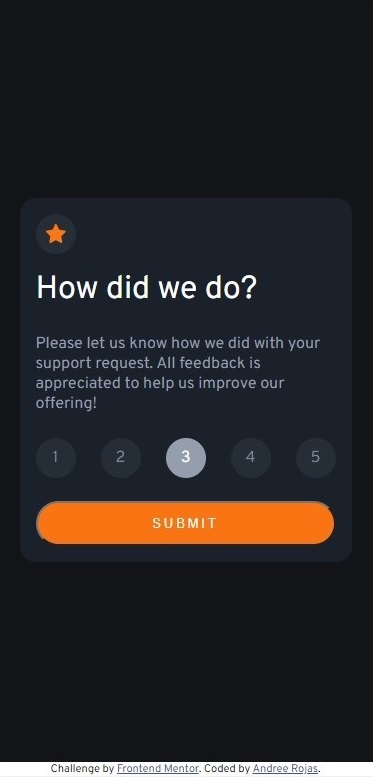

# Frontend Mentor - Interactive rating component solution

This is a solution to the [Interactive rating component challenge on Frontend Mentor](https://www.frontendmentor.io/challenges/interactive-rating-component-koxpeBUmI). Frontend Mentor challenges help you improve your coding skills by building realistic projects. 

## Table of contents

- [Overview](#overview)
  - [Screenshot](#screenshot)
- [My process](#my-process)
  - [Built with](#built-with)
- [Author](#author)

##Overview
### Screenshot
Mobile version

Desktop version

_

## My process
### Built with

- Semantic HTML5 markup
- CSS custom properties
- Flexbox

## Author

- Website - [Andree Rojas]